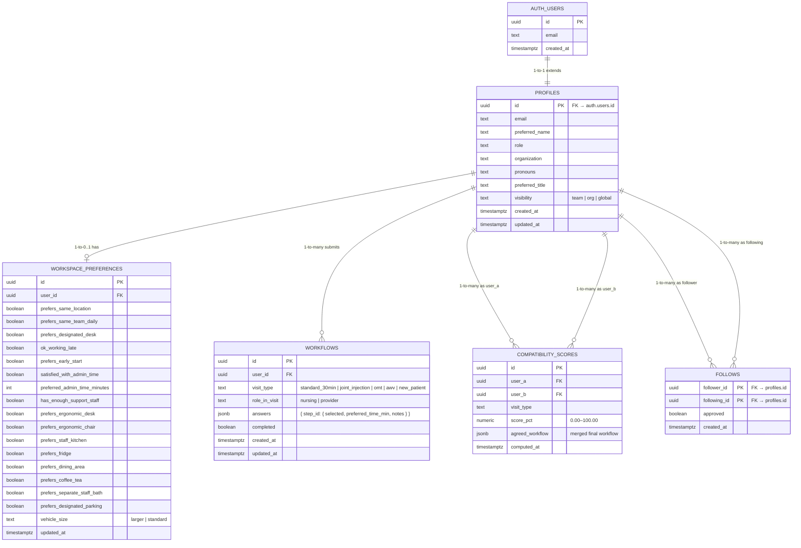

# FlowSync — Database Schema (ER Diagram)

## Key Constraints

| Table | PK | FK(s) | Unique Constraint |
|---|---|---|---|
| `profiles` | `id` | `id → auth.users.id` | — |
| `workspace_preferences` | `id` | `user_id → profiles.id` | — |
| `workflows` | `id` | `user_id → profiles.id` | `(user_id, visit_type, role_in_visit)` |
| `compatibility_scores` | `id` | `user_a → profiles.id`, `user_b → profiles.id` | `(user_a, user_b, visit_type)` |
| `follows` | `(follower_id, following_id)` composite | both → `profiles.id` | — (PK is the constraint) |

## Notes

- **`profiles.id`** is both a PK and an FK — it directly mirrors `auth.users.id` so Supabase Auth and app data stay in sync.
- **`workspace_preferences`** is 0..1 per user (a user may not have filled it out yet).
- **`workflows`** unique constraint prevents duplicate submissions for the same user + visit type + role combination.
- **`compatibility_scores`** stores both `user_a` and `user_b` as separate FKs so the join is symmetric and indexable.
- **`follows`** uses a composite PK `(follower_id, following_id)` — no surrogate key needed, the pair is inherently unique.
- **`answers` (jsonb)** in `workflows` is intentionally flexible so new workflow steps can be added without schema migrations.
